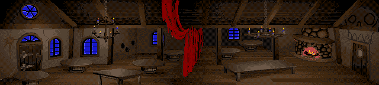
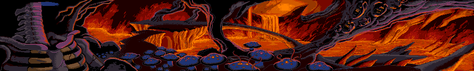
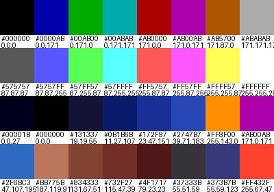
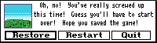

# MonkeyIslandAmigaGraphics

**MonkeyIslandAmigaGraphics** is a Python project for parsing and extracting graphical resources from the Amiga version of *The Secret of Monkey Island*.

The project was created primarily to extract the original room background artwork directly from the Amiga game resources, without objects or other graphical elements being composited over the backgrounds.



*An example room background extracted directly from the original Amiga SCUMM resources.*

## Project Status

### Version 1.2.0

Version 1.2.0 successfully extracts room backgrounds, object images and costume animation cels from all four disks of the Amiga version of *The Secret of Monkey Island*.

The program:

* Parses the SCUMM resource structure contained within the Amiga `.lec` files.
* Locates room (`RO`) resources and their associated palettes and `BM` bitmap data.
* Extracts `OI` object images associated with each room.
* Parses `CO` costume resources and extracts their individual graphical cels.
* Decodes the `BMCOMP_PIX32` compression used by Amiga room backgrounds and object images.
* Decodes the Amiga BYLE RLE compression used by costume graphics.
* Reconstructs the original indexed graphical resources.
* Saves room backgrounds and object images as 16-colour indexed PNG files.
* Saves costume cels as 16-colour indexed PNG files with transparency.
* Creates palette reference images for each room.

The current implementation has successfully extracted:

* **85 room background images**
* **659 object images**
* **3,123 costume animation cels from 118 costume resources**

across the four game disks.

A complete validation run identified 3,126 candidate costume cels. Of these, 3,123 were successfully decoded and saved. Three candidates were rejected because their interpreted dimensions were implausible. No costume decoding failures, save failures or unsupported costume formats were encountered.

Room backgrounds are deliberately exported without object or costume graphics composited over them, preserving the clean background artwork as stored in the game resources.

Development will continue with the aim of identifying and extracting additional graphical resources where practical.


## Requirements

Python 3 and the Pillow imaging library are required.

Pillow can be installed with:

```bash
pip install Pillow
```

A legally obtained copy of the Amiga version of *The Secret of Monkey Island* is also required.

### Game Files

The following four resource files are required:

```text
disk01.lec
disk02.lec
disk03.lec
disk04.lec
```

These should be placed inside a directory named `resource` in the project root:

```text
MonkeyIslandAmigaGraphics/
├── mi_amiga_graphics.py
├── resource/
│   ├── disk01.lec
│   ├── disk02.lec
│   ├── disk03.lec
│   └── disk04.lec
└── ...
```

The `resource/` directory is excluded from Git and no original game data is distributed with this project.

Development and testing has been performed using resource files from the **original, unmodified Amiga release** of *The Secret of Monkey Island*.

Modified or cracked/hacked versions of the game have not currently been tested and may contain differences that affect parsing or extraction. Use of the original, unmodified game data is therefore recommended.

## Usage

With the four `.lec` files in the `resource/` directory, run:

```bash
python mi_amiga_graphics.py
```

The program processes all four disks.

### Room Backgrounds

Room backgrounds are written to:

```text
Rooms/
├── disk01/
├── disk02/
├── disk03/
└── disk04/
```



*Example `BM` room background generated by the extractor.*

### Palettes

Palette reference images are written to:

```text
Palettes/
├── disk01/
├── disk02/
├── disk03/
└── disk04/
```



*Example 32-colour room palette generated from the original Amiga palette data.*

### Object Images

Object images are written to:

```text
Objects/
├── disk01/
│   ├── room_01/
│   ├── room_02/
│   └── ...
├── disk02/
├── disk03/
└── disk04/
```

Each object image retains the object identifier stored in its `OI` resource, for example:

```text
Objects/disk01/room_01/object_113.png
```



*Example `OI` object image extracted independently from its room background.*

### Costume Animation Cels

Costume animation cels are written to:

```text
Costumes/
├── disk01/
│   ├── room_01/
│   │   ├── costume_01/
│   │   │   ├── cel_001.png
│   │   │   ├── cel_002.png
│   │   │   └── ...
│   │   └── ...
│   └── ...
├── disk02/
├── disk03/
└── disk04/
```

Costume resources can contain multiple graphical cels representing animation frames or other graphical states. Each unique cel discovered by the extractor is saved separately.

Costume palette index 0 is exported as transparent, allowing the extracted artwork to be viewed independently of the room background.


*Example `CO` costume animation cel extracted with palette index 0 represented as transparency.*

The generated `Rooms/`, `Palettes/`, `Objects/` and `Costumes/` directories are excluded from Git.


## Graphics Formats

### Room Backgrounds and Object Images

The Amiga room backgrounds and object images are stored as compressed 8-pixel-wide bitmap strips.

For the resources currently supported by this project, each strip uses compression method `0x0A`, corresponding to the `BMCOMP_PIX32` decoding path used by ScummVM for the Amiga version of *The Secret of Monkey Island*.

The same strip decoder is used successfully for both main `BM` room backgrounds and `OI` object images.

For room backgrounds, the image dimensions are obtained from the room metadata. Object image widths are derived from their strip-offset tables, while their heights are determined by finding the height for which every compressed strip decodes completely and consumes its full payload.

The decoder produces 4-bit colour values representing 16 colours. These correspond to entries 16–31 of the room's 32-entry palette.

Room backgrounds and object images are saved as **4-bit, 16-colour indexed PNG files**, preserving the indexed-colour nature of the original Amiga artwork.

### Costume Graphics

Classic `CO` costume resources contain animation metadata and graphical cels used for characters and other animated elements.

The Amiga costume graphics supported by this project use the 16-colour `0x58` costume format and Amiga BYLE RLE compression.

Costume pixel data is reconstructed vertically, column by column. Each RLE value contains a colour index and run length, with extended run lengths stored in an additional byte when required.

Each costume contains its own 16-entry colour mapping into the associated room palette.

Extracted costume cels are saved as **4-bit, 16-colour indexed PNG files**, with costume colour index 0 represented as transparency.


## Goals

Version 1.0.0 fulfilled the project's original objective of extracting the clean room background artwork.

Version 1.1.0 extended the extractor to `OI` object images while continuing to preserve room backgrounds as separate, unpopulated images.

Version 1.2.0 adds extraction of `CO` costume resources, including individual animation cels for characters and other animated graphical elements.

The longer-term aim is to extract as much of the original Amiga graphical artwork as practical while retaining the individual resources rather than compositing them into reconstructed screenshots.


## ScummVM

The ScummVM source code has been used as an important reference for
understanding the structure and decoding of the original SCUMM resources.

The `BMCOMP_PIX32` strip decoder in this project is a Python adaptation
of the relevant decoding behaviour in ScummVM's SCUMM engine, including
its `drawStripEGA()` implementation.

ScummVM's handling of Amiga costume resources and BYLE RLE decoding was
also used as a reference while implementing costume extraction. The
Python code in this project was written specifically for extracting the
resources from the Amiga version of *The Secret of Monkey Island* rather
than reproducing ScummVM's rendering engine.

ScummVM is copyright its respective authors and is distributed under
the GNU General Public License.

## SCUMM Revisited

SCUMM Revisited was used during development to inspect the structure of
the original game resources, including their chunk hierarchy, offsets,
sizes and raw data.

The SCUMM chunk descriptions used by this project, such as `RO`, `BM`,
`OI` and `CO`, retain the naming convention presented by SCUMM Revisited,
including question marks where the original utility itself describes a
chunk tentatively.

SCUMM Revisited does not decode the Amiga graphical resources extracted
by this project, but its resource browser and HexView were valuable tools
during investigation of the original data.

## Game Data and Copyright

Original game files and extracted game artwork are **not included** with this project.

Users must provide their own legally obtained copy of the relevant game data.

*The Secret of Monkey Island* and its original artwork are the property of their respective copyright holders.

## Licence

This project is distributed under the terms of the **GNU General Public License version 3 or later (GPLv3+)**.

See the `LICENSE` file for details.

## Acknowledgements

* The ScummVM project and its contributors for their extensive work documenting and implementing support for the SCUMM engine.
* SCUMM Revisited and its developers for providing a valuable resource inspection tool and terminology reference during development.
* Lucasfilm Games / LucasArts for *The Secret of Monkey Island*.
